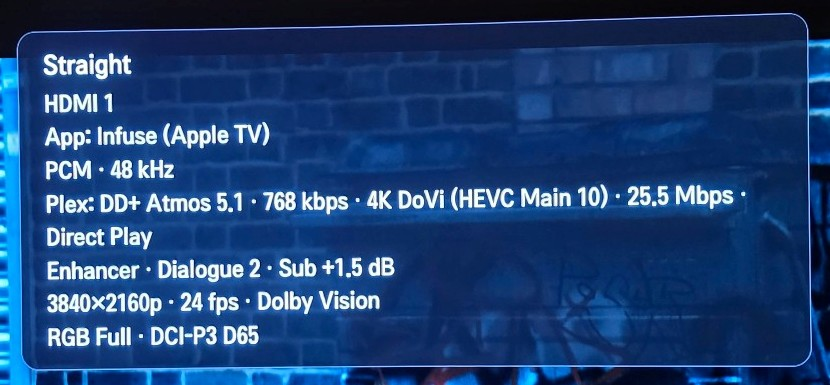
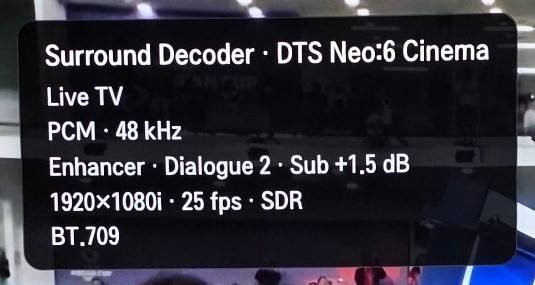
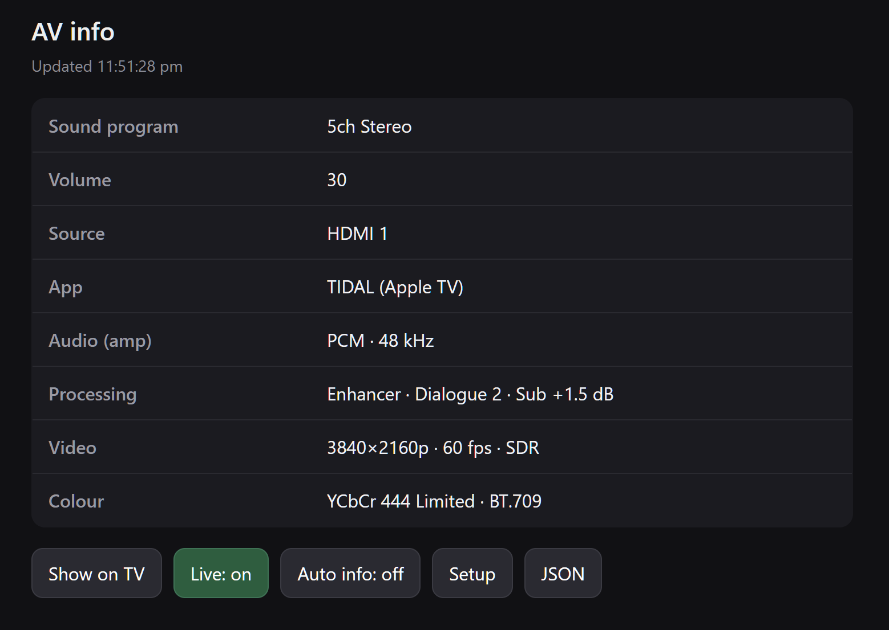
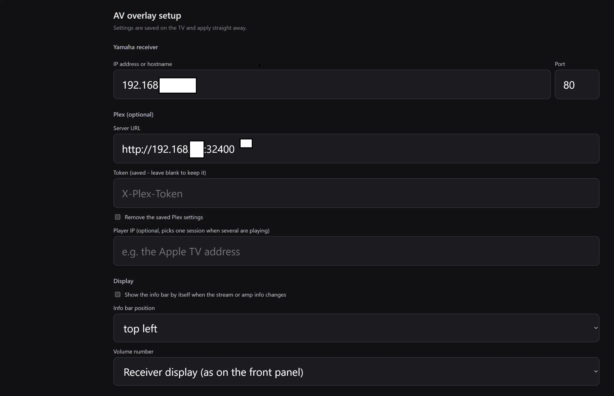
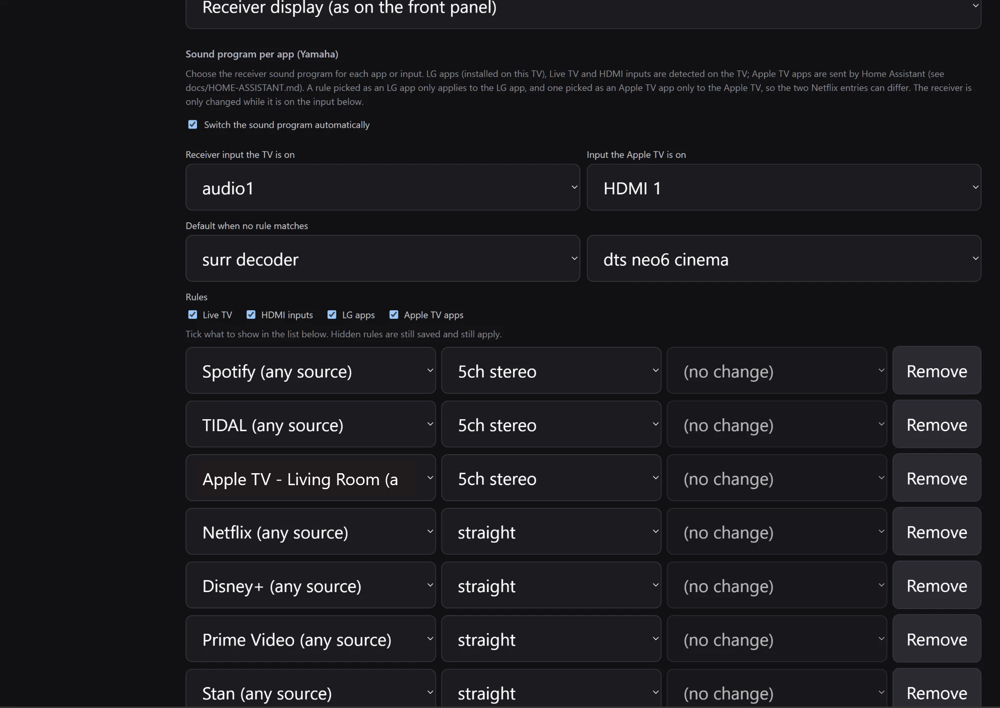
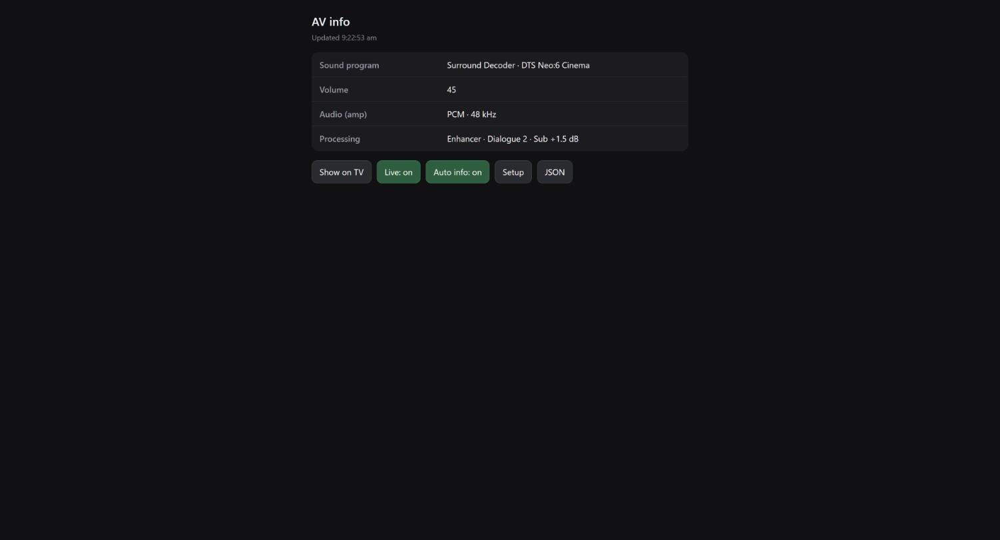
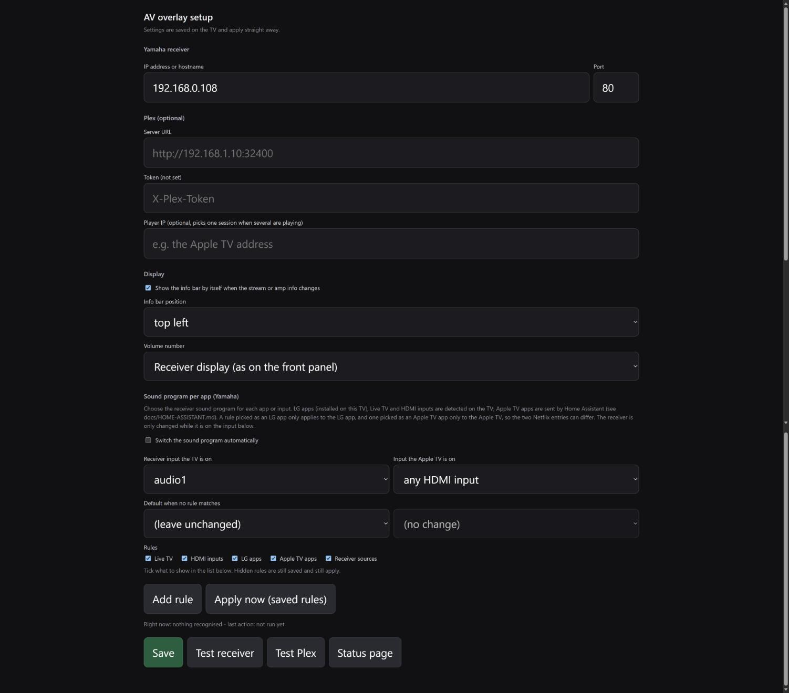

# AV Overlay for LG webOS

On-screen volume and stream information for a rooted LG webOS TV that sends its audio to a
**Yamaha receiver** (tested on an RX-V485 over eARC). It is a fork of
[Nikolay1243/Webos-EARC-Volume-Overlay](https://github.com/Nikolay1243/Webos-EARC-Volume-Overlay),
which showed a numeric volume; this version reads the receiver directly and adds an info bar.

<table>
  <tr>
    <td align="center" valign="top">
      <br>
      <sub>The info bar over Dolby Vision from an Apple TV app: sound program, input, detected app, audio, Plex stream (direct play), amp processing, video and colour.</sub>
    </td>
    <td align="center" valign="top">
      <br>
      <sub>On Live TV the bar shows the surround decoder, the PCM audio the receiver gets, and the broadcast video format.</sub>
    </td>
  </tr>
</table>

<table>
  <tr>
    <td align="center" valign="top" width="50%">
      <br>
      <sub>The status page (<code>/status</code>): current values, Show/Hide on TV, a live view and the Auto info switch.</sub>
    </td>
    <td align="center" valign="top" width="50%">
      <br>
      <sub>The setup page (<code>/setup</code>): receiver address, optional Plex and Jellyfin, info bar settings, and per-app sound programs. Sections are collapsible.</sub>
    </td>
  </tr>
</table>

<br>
<sub>Per-app sound programs on the setup page: a default, then one rule per input, LG app or Apple TV app, with tick boxes to show or hide each group.</sub>

- **Volume popup** (bottom-right) whenever the receiver's volume or mute changes, including half steps.
- **Info bar** with the sound program, source, audio format, Plex or Jellyfin stream details (optional),
  amp processing, video format/HDR and colour. It appears when something changes (switchable), on
  demand, or pinned on screen.
- **Status page** at `http://<tv>:41101/status` with toggle switches for Show on TV, live view, and Auto info.
- **Setup page** at `http://<tv>:41101/setup`, also opened by the **AV Overlay Settings** icon on the TV home screen.
- **Sound program per app**: pick the receiver's sound program for Live TV, each HDMI input, webOS apps (Netflix,
  YouTube, ...), Plex players and, with a small Home Assistant automation, each Apple TV app. See
  [docs/HOME-ASSISTANT.md](docs/HOME-ASSISTANT.md).
- Endpoints for automation: `/info`, `/status.json`, `/tv/show`, `/tv/hide`, `/app?name=...`.

## Requirements

- An LG TV that is **rooted** with the [Homebrew Channel](https://www.webosbrew.org/) installed.
  Rooting is not covered here and can void your warranty. Firmware updates can remove root.
- **SSH access to the TV as root**, ideally with a key.
- A **Yamaha receiver with the Extended Control API** (most MusicCast and recent RX-V models), on the same LAN.
  Other brands are not supported.
- Optional: a **Plex** server and its token, or a **Jellyfin** server and an API key, for stream details.

## Deployment options

There are two ways to run the watcher process. The TV apps (the visual overlay and the settings launcher) are
installed the same way in both cases.

### Option A — on the TV (default)

The watcher runs directly on the rooted TV as a background service. Nothing extra is needed.

**Requirements:** Node.js 18+, `ssh`/`scp`, and a POSIX shell (macOS, Linux, or Git Bash/WSL on Windows).

See [docs/INSTALL.md](docs/INSTALL.md) for the full guide, from rooting the TV to Home Assistant.

```sh
git clone https://github.com/SammySco/webos-av-overlay
cd webos-av-overlay
TV_HOST=root@TV_IP sh scripts/install.sh
```

**On Windows**, unpack the release archive and double-click `Install-AVOverlay.cmd` (no Git Bash or Node needed,
only the built-in OpenSSH Client), or run `scripts\install.ps1`; it asks the same questions.

### Option B — in Docker (on a home server or Raspberry Pi)

The watcher runs in a Docker container on a separate Linux host on the same LAN. The TV apps are still installed
on the TV; only the background process moves off the TV. This keeps the TV free of the Node.js runtime and makes
updates easier.

**Requirements:** a Linux host on the same LAN, Docker Engine, and an SSH key that can reach the TV.
For instant amp volume events `network_mode: host` is used — this works on Linux Docker Engine but not on
Docker Desktop (Mac/Windows).

See [docs/DOCKER.md](docs/DOCKER.md) for the full guide.

```sh
git clone https://github.com/SammySco/webos-av-overlay
cd webos-av-overlay
sh scripts/docker/install.sh   # checks prerequisites, configures, and starts the container
```

<table>
  <tr>
    <td align="center" valign="top" width="50%">
      <br>
      <sub>The status page at <code>http://&lt;docker-host&gt;:41101/status</code>: current receiver state, Show/Hide on TV, and controls.</sub>
    </td>
    <td align="center" valign="top" width="50%">
      <br>
      <sub>The setup page at <code>http://&lt;docker-host&gt;:41101/setup</code>: receiver address, Plex, display and sound-program rules.</sub>
    </td>
  </tr>
</table>

---

The installer builds two packages (the overlay and the **AV Overlay Settings** launcher app), installs them,
asks a few questions, and starts the service:

| Question | Notes |
|---|---|
| Yamaha receiver IP/hostname | Checked from the TV; required for the overlay to do anything |
| Plex server URL, token, player IP | Optional. The token prompt is hidden and the token is only sent over SSH |
| Auto info on/off | Show the info bar by itself when something changes |
| Info bar position | top-left, top-center, top-right, middle-left, middle-right, bottom-left, bottom-center or bottom-right |

Jellyfin is not asked by the installer — configure it at `/setup` after installation.

Every answer can be supplied as an environment variable instead, and `EARC_NONINTERACTIVE=1` skips all questions.
Settings are stored on the TV in `/home/root/.earc-overlay.json` (readable by root only) and can be changed any
time at `/setup` or from the TV home screen.

The setup and status pages have no password and are meant for your home network only.

## Change settings later

Open **AV Overlay Settings** on the TV home screen, or browse to `http://<tv>:41101/setup`. Changes apply immediately.

## Android companion app

An Android app wraps the status page in a full-screen WebView so you can check the current state and control
the overlay from your phone. The app title updates to match the TV's device name (e.g. *Living Room TV - AV Info*).

Download **AV-Overlay-status.apk** from the [latest release](https://github.com/SammySco/webos-av-overlay/releases/latest),
install it (allow installs from unknown sources), and enter your TV's IP address when prompted.
It requires Android 7.0 or later and your phone to be on the same Wi-Fi as the TV.

## Uninstall

```sh
TV_HOST=root@TV_IP sh scripts/uninstall.sh          # keeps your settings
TV_HOST=root@TV_IP sh scripts/uninstall.sh --purge  # also deletes them
```

## Troubleshooting

On the TV, `tail -f /tmp/earc-volume-overlay.log`. A healthy start looks like:

```text
service starting (yamaha 192.168.1.50, with signal info)
watching 192.168.1.50 at 42:false
```

- *"amp not configured"*: enter the receiver address at `/setup`.
- *"amp unreachable"*: check the address, that the receiver is on, and that "Network Standby" is enabled on it.
  While the receiver is not answering, the bar and the `/status` and `/info` pages say **"Receiver not responding"** with
  when it last answered, and the receiver's own numbers (volume, sound program, audio) are withheld instead of showing
  the last value; `/status.json` has `reachable` and `lastOk`. The volume popup simply does not appear.
- Remote channel up/down while the info bar is on screen: the first key press dismisses the bar and is
  passed on to Live TV, so one press still changes the channel.

## How it works

A root-side Node.js watcher on the TV subscribes to the receiver's events (with a poll as a fallback) and to the
TV's video output, foreground app and running-app state (luna subscriptions, not polling), and optionally reads Plex or
Jellyfin. It launches a transparent web app to draw the volume popup and the
info bar, and serves the status and setup pages on port 41101. The app closes itself when nothing is showing,
because an open overlay window takes the remote's key focus.

## Development disclosure

The original project was developed with substantial assistance from OpenAI Codex. This fork's additions were
developed with Claude Code, with testing on a real rooted LG webOS TV and a Yamaha RX-V485 by the maintainer.

## Safety

This is unofficial software for rooted TVs. Firmware updates can change private webOS services or remove root
access. Keep a known recovery path for your TV and review scripts before running them.

## Licence

MIT
